# VitalAI LangGraph Tree

Tài liệu này mô tả đúng graph đang được build trong `src/LLM/qa/graph.py`.

Phân biệt quan trọng:

- **LangGraph node** là các node được đăng ký bằng `graph.add_node(...)`.
- **Tool/sub-flow** là logic hoặc service được gọi bên trong node, không phải LangGraph node riêng.
- API FastAPI ở `src/api/app.py` không nằm trong LangGraph, nhưng là entrypoint public gọi graph.

## Entry Points

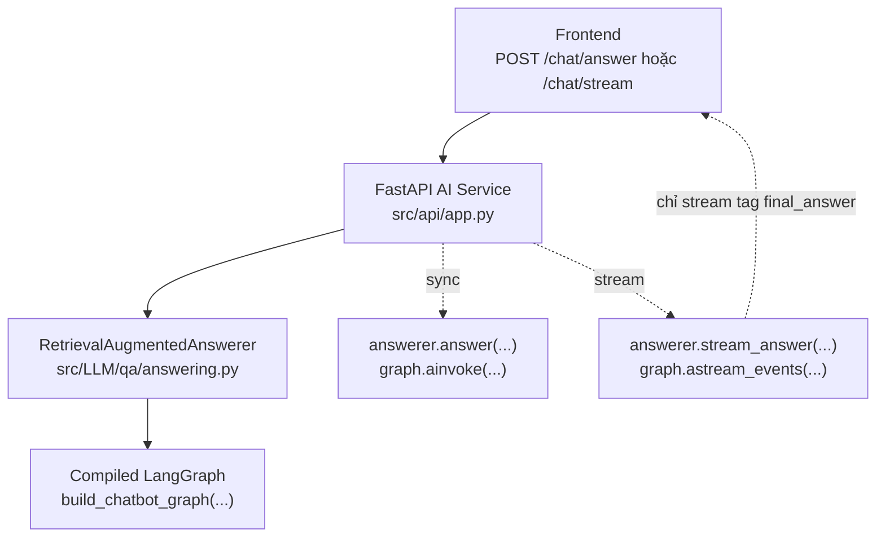

Public API hiện có:

- `GET /health`
- `POST /chat/answer`: gọi `answerer.answer(...)`, trả JSON sau khi graph chạy xong.
- `POST /chat/stream`: gọi `answerer.stream_answer(...)`, trả SSE `token` và `done`.
- `POST /voice/tts/prepare`: endpoint phụ cho frontend voice mode, không đi qua LangGraph.

Streaming lưu ý:

- `stream_answer(...)` chỉ emit token từ event có tag `final_answer`.
- Router LLM nội bộ có tag `internal_router`, không được stream ra frontend.

## Main LangGraph

Đây là graph edge thật được khai báo trong `build_chatbot_graph(...)`.

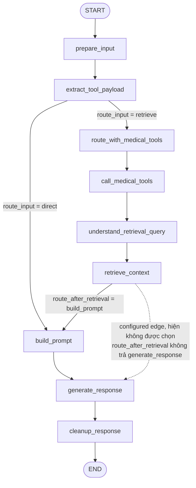

Edge table:

| From | Route function | Condition | To | Ghi chú |
|---|---|---:|---|---|
| `START` | none | always | `prepare_input` | Entry point |
| `prepare_input` | none | always | `extract_tool_payload` | Chuẩn hóa input trước khi route |
| `extract_tool_payload` | `route_input` | `_is_direct_query(query) == True` | `build_prompt` | Bỏ qua router/tool/RAG cho lời chào/cảm ơn/hỏi khả năng hệ thống |
| `extract_tool_payload` | `route_input` | otherwise | `route_with_medical_tools` | Luồng y khoa hoặc câu hỏi cần RAG |
| `route_with_medical_tools` | none | always | `call_medical_tools` | Dù có cần tool hay không, node sau vẫn đọc `router_plan` |
| `call_medical_tools` | none | always | `understand_retrieval_query` | Nếu không cần tool thì chỉ set structured context rỗng |
| `understand_retrieval_query` | none | always | `retrieve_context` | Tạo retrieval plan an toàn bằng hard filters + soft hints |
| `retrieve_context` | `route_after_retrieval` | always returns `build_prompt` | `build_prompt` | Đây là hành vi hiện tại |
| `retrieve_context` | `route_after_retrieval` | `generate_response` branch exists but not returned | `generate_response` | Edge được khai báo nhưng hiện không reachable |
| `build_prompt` | none | always | `generate_response` | Dựng prompt trước khi gọi final LLM |
| `generate_response` | none | always | `cleanup_response` | Sinh hoặc fallback raw answer |
| `cleanup_response` | none | always | `END` | Trả state cuối |

## Graph State

State được định nghĩa bằng `ChatbotGraphState`.

Các field chính:

- Input/request: `query`, `top_k`, `disease_name`, `section_type`, `source_type`, `biomarker`.
- Route/retrieval: `route`, `retrieval`, `retrieval_plan`, `filters`, `query_understanding`, `debug_results`.
- Evidence/prompt: `evidence_items`, `evidence_context`, `prompt_messages`.
- Medical tool: `tool_contract`, `router_plan`, `router_error`, `medical_tool_result`, `structured_context`, `extracted_tool_payload`, `supported_tool_context`.
- Output: `raw_answer`, `final_answer`, `user_sources`.

## Node Details

### 1. `prepare_input`

Mục tiêu:

- Chuẩn hóa whitespace của `query`.
- Set `top_k`.
- Reset các field graph quan trọng để không giữ state cũ.
- Build `supported_tool_context` từ danh sách biomarker/formula/variable service hỗ trợ.
- Tạo filter ban đầu từ request API.

State ghi ra:

- `query`
- `top_k`
- `router_plan = None`
- `medical_tool_result = None`
- `structured_context = "Không có kết quả phân tích chỉ số."`
- `extracted_tool_payload = {"text": query}`
- `supported_tool_context`
- `filters`

Tool/sub-flow gọi:

- `build_supported_tool_context()`

### 2. `extract_tool_payload`

Mục tiêu:

- Parse sớm chỉ số/công thức từ text bằng deterministic parser.
- Tạo payload sạch không có `null` để dùng cho medical tools.
- Không gọi LLM.

Tool/sub-flow gọi:

- `build_tool_input_payload(query)`
- `build_supported_tool_context()`

Payload có thể chứa:

```json
{
  "text": "ACR 350 mg/g, GFR 55 ml/ph/1.73m2",
  "measurements": {
    "ACR": {"value": 350, "unit": "mg/g"},
    "GFR": {"value": 55, "unit": "ml/ph/1.73m2"}
  },
  "disease_name": "benh_than_man"
}
```

Parser hỗ trợ:

- Biomarker aliases từ `services/medical_tools/aliases.py`.
- Formula variable aliases như `age`, `sex`, `race`, `creatinine_mg_dl`, `urine_na`, `plasma_na`, `urine_creatinine`, `plasma_creatinine`.
- Unit normalization qua `UNIT_ALIASES`.
- Enrich biến công thức từ creatinine/plasma creatinine khi phù hợp.

### 3. Conditional `route_input`

Route function này chạy sau `extract_tool_payload`.

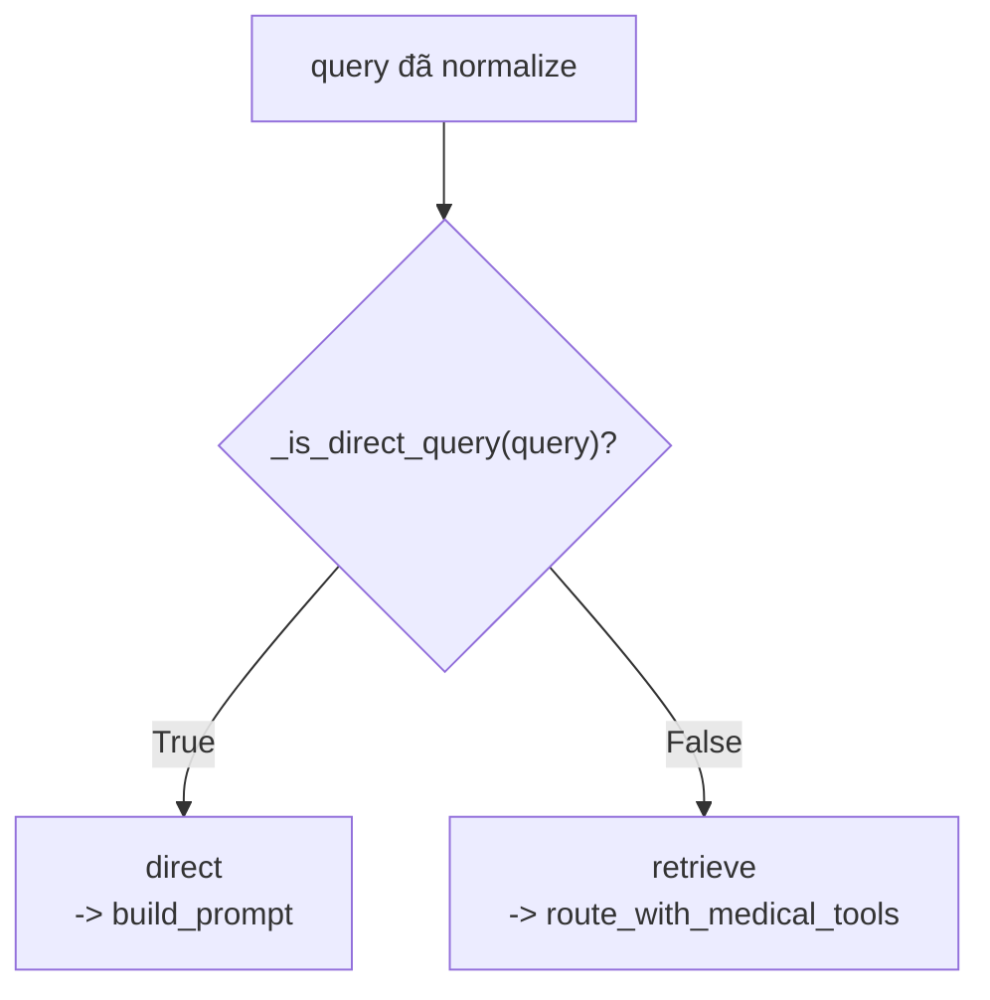

`_is_direct_query(...)` chỉ trả `True` cho lời chào/cảm ơn/hỏi khả năng hệ thống đơn giản:

- `hi`
- `hello`
- `hey`
- `xin chao`
- `chao`
- `chao ban`
- `cam on`
- `thanks`
- `thank you`
- `ban la ai`
- `ban lam duoc gi`

Nếu query có keyword y khoa như `la gi`, `khai niem`, `dinh nghia`, `lupus`, `than`, `benh`, `acr`, `gfr`, `creatinine`, `creatinin`, `fena`, `trieu chung`, `dieu tri`, `chan doan` thì không đi direct.

### 4. `route_with_medical_tools`

Mục tiêu:

- Quyết định có cần gọi medical tools service không.
- Ưu tiên heuristic deterministic.
- Nếu heuristic không quyết được, gọi router LLM nội bộ.
- Nếu router lỗi, fallback sang RAG thường.

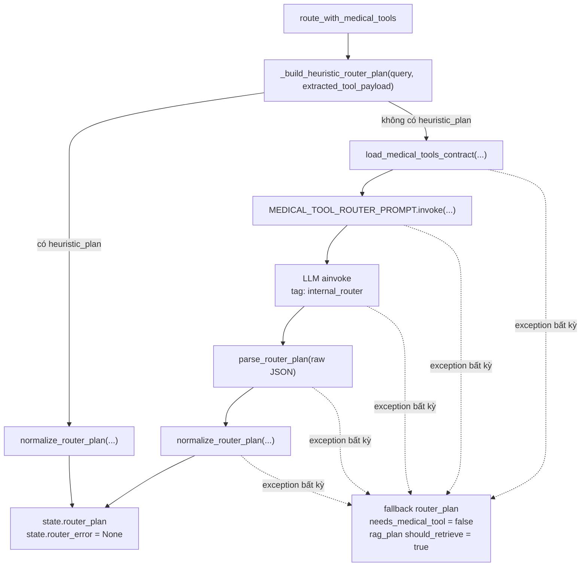

#### 4.1 Heuristic formula route

`_detect_formula_ids(...)` chọn công thức như sau:

| Điều kiện | `formula_id` |
|---|---|
| Query có `fena` hoặc `fractional excretion of sodium` | `fena_formula` |
| Query có đủ FENa input set và có ý định tính | `fena_formula` |
| Query có `mdrd` | `mdrd_gfr` |
| Query có `egfr`, `e gfr`, `tinh gfr`, `uoc tinh gfr` | `ckd_epi_2021_creatinine` |
| Query có creatinine + tuổi + giới + hỏi đánh giá chức năng thận | `ckd_epi_2021_creatinine` |
| Query có `cockcroft`, `gault`, `creatinine clearance`, `do thanh thai creatinine` | `cockcroft_gault` |
| Query có `bsa`, `dien tich da` | `body_surface_area` |

Nếu có `formula_ids`, heuristic tạo `router_plan`:

- `needs_medical_tool = true`
- `tool_call.tool_name = "medical_tools.evaluate"`
- `tool_call.method = "POST"`
- `tool_call.endpoint = "/mcp/medical-tools/evaluate"`
- `tool_call.parameters` gồm `text`, `formula_ids`, `include_debug = false`, optional `measurements`, optional `disease_name`.
- `rag_plan.should_retrieve = true`
- `rag_plan.filters.source_type = "chunk"`
- `reason = heuristic_formula_values` hoặc `heuristic_formula_and_threshold_values`.

Disease heuristic:

- Nếu có `fena_formula` thì mặc định `acute_kidney_injury`.
- Nếu query có `acr`, `gfr`, `benh than man`, `ckd` thì dùng `benh_than_man`.
- Các công thức eGFR/Cockcroft/BSA không thuộc FENa thì thường dùng `benh_than_man`.

#### 4.2 Heuristic threshold route

Nếu không có formula nhưng `extracted_tool_payload` có `measurements`:

- `needs_medical_tool = true`
- `formula_ids = []`
- Nếu query có `acr` hoặc `gfr`, set `disease_name = "benh_than_man"`.
- `section_type = "classification"`
- `reason = heuristic_threshold_values`

#### 4.3 Router LLM route

Nếu heuristic không bắt được:

Tool/sub-flow:

- `load_medical_tools_contract(...)`: đọc `src/LLM/tool_contracts/medical_tools_contract.md`.
- `MEDICAL_TOOL_ROUTER_PROMPT`: prompt router nội bộ.
- `llm.ainvoke(..., tags=["internal_router"], metadata={"internal": True})`.
- `parse_router_plan(...)`: parse JSON object từ output router.
- `normalize_router_plan(...)`: sanitize endpoint/filter/parameters.

Router output sau normalize luôn có shape:

```json
{
  "needs_medical_tool": true,
  "tool_call": {
    "tool_name": "medical_tools.evaluate",
    "method": "POST",
    "endpoint": "/mcp/medical-tools/evaluate",
    "parameters": {
      "text": "...",
      "formula_ids": [],
      "include_debug": false
    }
  },
  "rag_plan": {
    "should_retrieve": true,
    "query": "...",
    "filters": {
      "disease_name": null,
      "section_type": null,
      "source_type": "chunk",
      "biomarker": null
    }
  },
  "missing_inputs": [],
  "reason": "..."
}
```

Normalize rules quan trọng:

- Drop `null` khỏi tool parameters.
- Chỉ giữ supported `formula_ids`.
- Canonicalize `disease_name`.
- `source_type` mặc định là `chunk`.
- `section_type` chỉ giữ nếu thuộc allowlist.
- Tool name luôn normalize về `medical_tools.evaluate`.

### 5. `call_medical_tools`

Mục tiêu:

- Gọi external Medical Tools Service nếu `router_plan.needs_medical_tool = true`.
- Nếu không cần tool, chỉ tạo structured context rỗng.

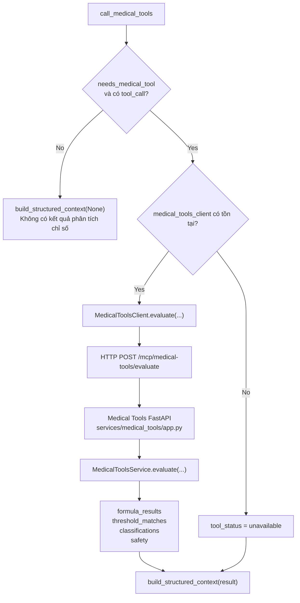

MedicalToolsClient behavior:

- Chỉ cho phép endpoint thuộc `ALLOWED_ENDPOINTS`.
- Gọi HTTP bằng `urllib.request` trong `asyncio.to_thread(...)`.
- Timeout mặc định `8s`.
- Các lỗi trả về structured JSON thay vì raise:
  - `tool_status = blocked`
  - `tool_status = http_error`
  - `tool_status = unavailable`
  - `tool_status = timeout`
  - `tool_status = bad_json`

Medical Tools Service endpoints:

- `GET /health`
- `GET /mcp/capabilities`
- `GET /structured/capabilities`
- `POST /mcp/medical-tools/evaluate`
- `POST /structured/evaluate`

Medical Tools output chính:

- `detected_measurements`
- `derived_measurements`
- `threshold_matches`
- `threshold_evaluations`
- `classifications`
- `formula_results`
- `safety`

Formula hiện support:

- `ckd_epi_2021_creatinine`
- `mdrd_gfr`
- `cockcroft_gault`
- `body_surface_area`
- `fena_formula`

### 6. `understand_retrieval_query`

Mục tiêu:

- Tách retrieval understanding khỏi router medical tool.
- Hợp nhất tín hiệu từ user query, request filters, `router_plan`, `extracted_tool_payload` và `medical_tool_result`.
- Chỉ dùng hard filter khi có bằng chứng rõ hoặc confidence cao.
- Đưa tín hiệu chưa chắc vào `soft_hints` và `query` để retriever rerank, tránh khóa cứng làm mất recall.

Tool/sub-flow gọi:

- `build_retrieval_plan(...)` trong `src/LLM/retrieval/query_planner.py`.

Output `retrieval_plan`:

```json
{
  "strategy": "deterministic_tool_aware_query_planner_v1",
  "query_type": "medical_qa | threshold | formula | definition",
  "query": "query đã enrich bằng bệnh/chỉ số/mục cần tìm",
  "filters": {
    "disease_name": "string hoặc null",
    "section_type": "string hoặc null",
    "source_type": "chunk",
    "biomarker": "string hoặc null"
  },
  "soft_hints": {
    "disease_names": [],
    "section_types": [],
    "biomarkers": [],
    "terms": []
  },
  "candidates": {
    "diseases": [],
    "sections": [],
    "biomarkers": []
  },
  "confidence": {
    "disease": 0.9,
    "section": 0.8,
    "biomarker": 0.9
  },
  "reason": "..."
}
```

Hard filter policy:

- `disease_name`: chỉ hard khi request filter explicit hoặc medical tool trả disease rõ. Query alias chỉ là soft hint vì nhiều evidence đúng đang nằm dưới metadata rộng như `benh_ly_cau_than`.
- `section_type`: chỉ hard khi request filter explicit; nếu do intent suy ra thì để soft hint vì metadata section trong corpus có thể chưa hoàn hảo.
- `biomarker`: chỉ hard khi request filter explicit; còn lại dùng soft hint để tránh miss chunk có biomarker metadata lệch.
- `source_type`: mặc định `chunk`.

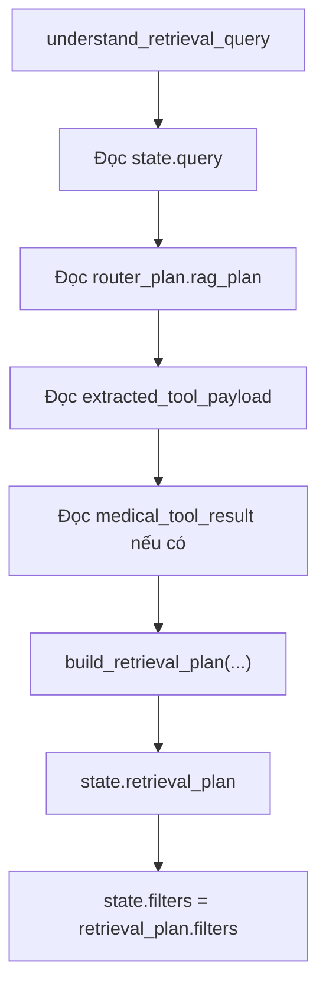

### 7. `retrieve_context`

Mục tiêu:

- Chọn query/filter từ `retrieval_plan`.
- Nếu chưa có `retrieval_plan`, fallback về `router_plan.rag_plan` và tool-informed query cũ.
- Gọi retriever hybrid.
- Lọc evidence nhiễu.
- Nếu DB chưa có evidence phù hợp nhưng tool có source text, dùng tool source text làm fallback evidence.

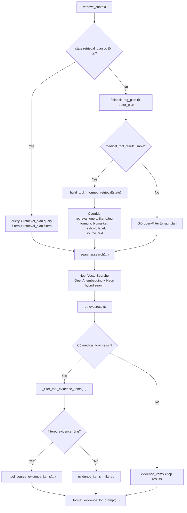

Tool-informed retrieval lấy tín hiệu từ:

- Matched threshold.
- Formula result.
- Derived measurement.
- Disease name từ threshold.
- Biomarker.
- Classification label.
- Threshold condition phrase.
- Source text trong tool result.

Retriever thật:

- `NeonVectorSearcher.search(...)`.
- `_understand_query(...)` để derive disease/section/biomarker hint.
- `_embed_query(...)` gọi OpenAI Embeddings.
- `_search_vector_rows(...)` query vector similarity từ bảng `medical_documents`.
- `_search_keyword_rows(...)` query full-text search.
- `_fuse_rows(...)` hợp nhất bằng reciprocal-rank-fusion style.
- `_expand_result_contexts(...)` mở rộng result bằng heading/chunk lân cận khi cần, rồi trả `content` đầy đủ hơn cho prompt/eval.

State ghi ra:

- `route = "retrieve"`
- `retrieval`
- `evidence_items`
- `evidence_context`
- `debug_results`
- `query_understanding` gồm `retrieval_planner` và `searcher`
- `filters`

### 8. Conditional `route_after_retrieval`

Hàm hiện tại:

```python
def route_after_retrieval(state):
    return "build_prompt"
```

Kết luận:

- Edge `retrieve_context -> build_prompt` luôn được chọn.
- Edge `retrieve_context -> generate_response` có khai báo trong graph map nhưng hiện không reachable.

### 9. `build_prompt`

Mục tiêu:

- Nếu chưa có `retrieval`, dùng prompt direct.
- Nếu có `retrieval`, dùng prompt RAG với `evidence_context` và `structured_context`.

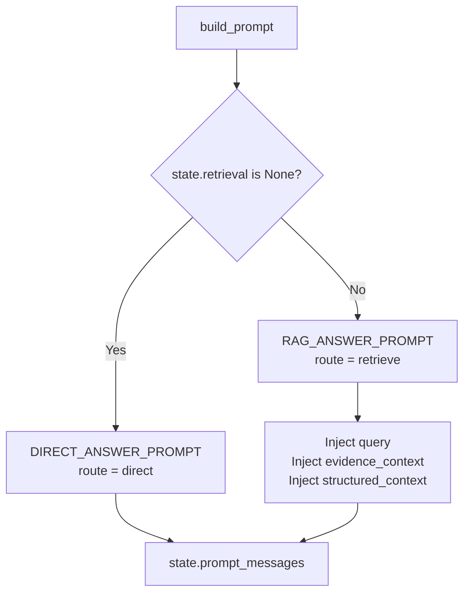

Prompt files:

- `src/LLM/prompts/templates.py`
- `DIRECT_ANSWER_PROMPT`
- `RAG_ANSWER_PROMPT`
- System prompt dùng `VITALAI_SYSTEM_PROMPT`.

RAG prompt rule quan trọng:

- Chỉ dùng dữ liệu trong RAG hoặc structured result.
- Không tự tính lại số liệu.
- Không lộ source/page/citation/JSON/endpoint/MCP/router/graph/id/score/metadata nội bộ.
- Nếu dữ liệu chỉ gợi ý thì không biến thành chẩn đoán chắc chắn.

### 10. `generate_response`

Mục tiêu:

- Sinh final answer bằng LLM hoặc trả fallback deterministic.

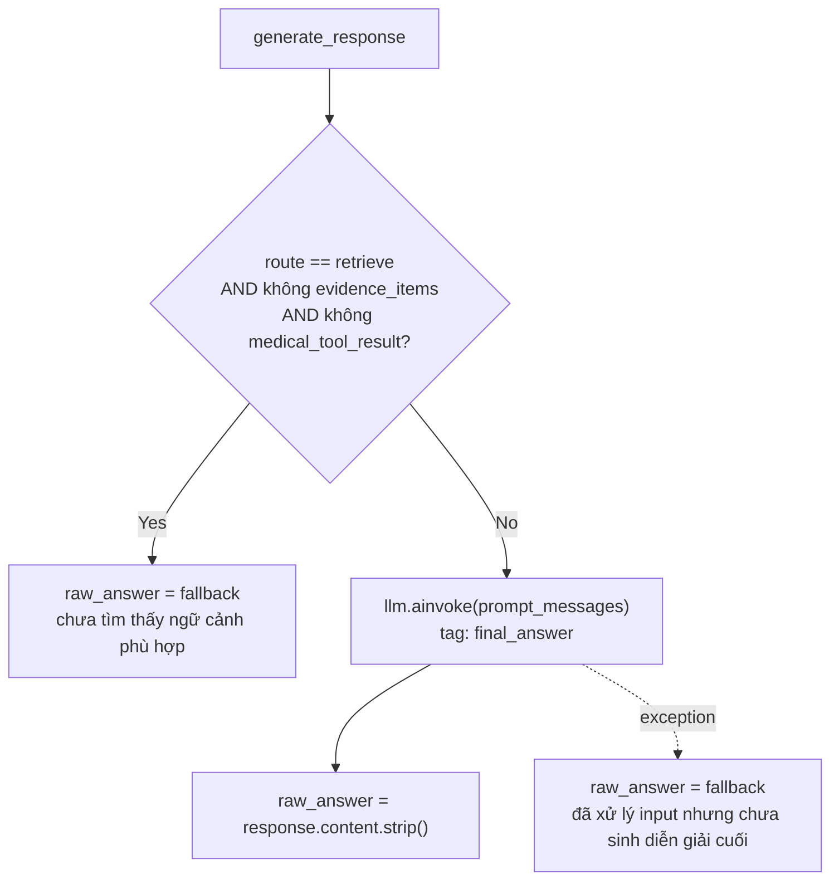

LLM call:

- Dùng cùng `llm` được khởi tạo trong `build_answerer_from_env()`.
- Với Mistral: `ChatMistralAI(model=MODEL_NAME, api_key=MISTRAL_CLIENT_API_KEY, max_tokens=2048, temperature=MISTRAL_TEMPERATURE)`.
- Tag: `final_answer`.
- Metadata: `{"internal": False}`.

### 11. `cleanup_response`

Mục tiêu:

- Làm sạch output cuối.
- Build source metadata an toàn cho UI.

Tool/sub-flow:

- `cleanup_user_answer(raw_answer)`
- `_build_user_sources(evidence_items)`

Cleanup loại:

- `nguồn 1`, `theo nguồn 1`
- citation/source/page/document_id/source_id
- score/sim/fts
- context tags
- khoảng trắng và dòng trống dư

`user_sources` an toàn chỉ gồm:

- `label`
- `source_type`
- `section_type`
- `disease_name`
- `preview` cắt còn 240 ký tự

## End-To-End Branches

### Branch A: Direct Query

Ví dụ: `xin chào`, `bạn là ai`.

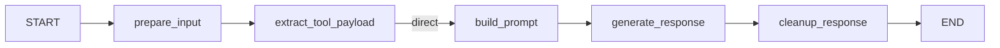

Đặc điểm:

- Không gọi router LLM.
- Không gọi medical tools.
- Không gọi RAG.
- Prompt dùng `DIRECT_ANSWER_PROMPT`.

### Branch B: General Medical RAG Without Tool

Ví dụ: câu hỏi y khoa không có chỉ số/công thức rõ ràng và router quyết định không cần tool.

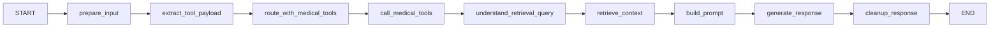

Đặc điểm:

- `route_with_medical_tools` có thể gọi router LLM nội bộ.
- `call_medical_tools` không gọi HTTP tool nếu `needs_medical_tool = false`.
- `understand_retrieval_query` vẫn tạo plan để RAG có query/filter/soft hints rõ hơn.
- `retrieve_context` vẫn gọi RAG.
- Prompt dùng `RAG_ANSWER_PROMPT`.

### Branch C: Threshold/Formula With Medical Tool

Ví dụ:

- `ACR 350 mg/g đánh giá giúp tôi`
- `Nữ 60 tuổi, creatinine 1.4 mg/dL. Hãy ước tính eGFR`
- `Natri niệu 20, natri máu 140, creatinine niệu 100, creatinine máu 1. Tính FENa`

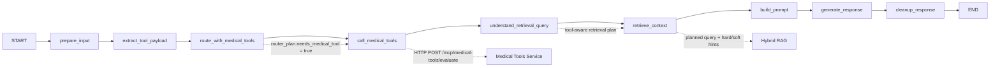

Đặc điểm:

- Heuristic thường bắt được, không cần router LLM.
- Medical tool trả kết quả structured.
- `structured_context` được inject vào final prompt.
- RAG query được viết lại qua `retrieval_plan`; tool result dùng để hard filter disease khi chắc và enrich query bằng ngưỡng/label/source text. Query alias bệnh không hard filter nếu không có tool result.

### Branch D: Router Failure Fallback

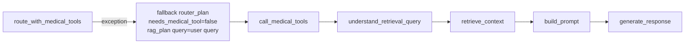

Đặc điểm:

- Không fail toàn bộ request chỉ vì router lỗi.
- Vẫn cố gắng trả lời bằng RAG thường.
- `router_error` được ghi trong debug nếu `include_debug = true`.

### Branch E: Medical Tools Unavailable

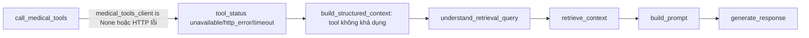

Đặc điểm:

- Request không crash.
- Prompt cuối được nhắc không tự tính công thức hoặc tự phân loại nếu thiếu dữ liệu chắc chắn.

## Full System With External Services

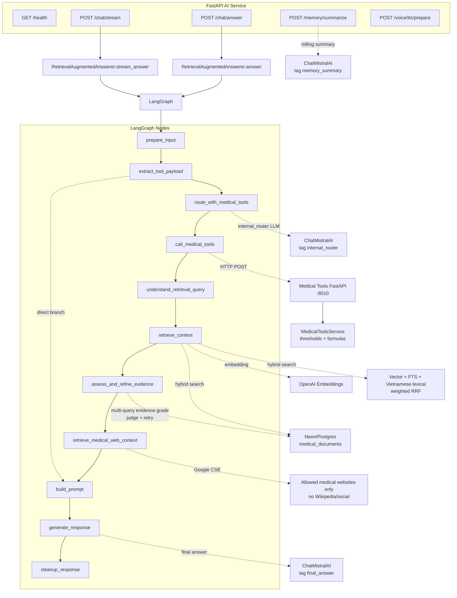

## Tool Inventory

### Internal deterministic tools/functions

| Tool/function | File | Được gọi ở node | Vai trò |
|---|---|---|---|
| `build_supported_tool_context` | `src/LLM/tools/medical_tools/request_builder.py` | `prepare_input`, `extract_tool_payload`, `route_with_medical_tools` | Tóm tắt supported biomarkers/formula variables/formula ids/disease names/section types cho router |
| `build_tool_input_payload` | `src/LLM/tools/medical_tools/request_builder.py` | `extract_tool_payload` | Parse deterministic chỉ số từ query |
| `tool_payload_has_supported_inputs` | `src/LLM/tools/medical_tools/request_builder.py` | `_build_heuristic_router_plan` | Xác định query có measurement để gọi tool |
| `sanitize_tool_parameters` | `src/LLM/tools/medical_tools/request_builder.py` | `normalize_router_plan` | Merge extracted payload + router output, drop null, filter field lạ |
| `parse_router_plan` | `src/LLM/tools/medical_tools/router_plan.py` | `route_with_medical_tools` | Parse JSON router output |
| `normalize_router_plan` | `src/LLM/tools/medical_tools/router_plan.py` | `route_with_medical_tools` | Canonicalize/sanitize plan |
| `build_structured_context` | `src/LLM/tools/medical_tools/context_formatter.py` | `call_medical_tools` | Convert tool JSON thành text sạch cho prompt |
| `build_retrieval_plan` | `src/LLM/retrieval/query_planner.py` | `understand_retrieval_query` | Tạo query/filter/soft hints an toàn cho RAG |
| `_build_agentic_subqueries` | `src/LLM/qa/graph.py` | `understand_retrieval_query`, `retrieve_context` | Tạo 1-3 sub-query deterministic từ disease/section/biomarker/term hints |
| `_grade_and_sort_evidence_items` | `src/LLM/qa/graph.py` | `retrieve_context`, `assess_and_refine_evidence` | Chấm từng chunk theo token hits/term hits/metadata/retrieval score rồi sort context |
| `_assess_evidence_quality` | `src/LLM/qa/graph.py` | `assess_and_refine_evidence` | Judge evidence đủ chưa bằng token coverage/term hits/top score |
| `_build_agentic_retry_query` | `src/LLM/qa/graph.py` | `assess_and_refine_evidence` | Rewrite query một lần từ soft hints để retry retrieval |
| `search_medical_web` | `src/LLM/web_search/medical_google_cse.py` | `retrieve_medical_web_context` | Google CSE bổ sung context từ allowlist web y tế, chặn Wikipedia/social |
| `cleanup_user_answer` | `src/LLM/qa/graph.py` | `cleanup_response`, `stream_answer` | Xóa metadata nội bộ khỏi answer |

### LLM tools/calls

| Call | Tag | Node | Prompt | Stream ra frontend? |
|---|---|---|---|---|
| Router LLM | `internal_router` | `route_with_medical_tools` | `MEDICAL_TOOL_ROUTER_PROMPT` | Không |
| Memory summary LLM | `memory_summary` | `POST /memory/summarize` | `MEMORY_SUMMARY_PROMPT` | Không |
| Final answer LLM | `final_answer` | `generate_response` | `DIRECT_ANSWER_PROMPT` hoặc `RAG_ANSWER_PROMPT` | Có, qua `/chat/stream` |

### External services

| Service | Called by | Endpoint/API | Vai trò |
|---|---|---|---|
| Medical Tools Service | `MedicalToolsClient.evaluate` | `POST /mcp/medical-tools/evaluate` | Parse chỉ số, tính formula, so threshold, phân loại |
| OpenAI Embeddings | `NeonVectorSearcher._embed_query` | `openai.embeddings.create` | Tạo query embedding |
| Neon/Postgres | `NeonVectorSearcher._search_vector_rows`, `_search_keyword_rows`, `_search_lexical_rows` | bảng `medical_documents` | Hybrid vector + FTS + Vietnamese lexical retrieval |
| Mistral Chat | `llm.ainvoke` | LangChain `ChatMistralAI` | Router JSON và final answer |
| Google Custom Search | `search_medical_web` | `customsearch/v1` | Bổ sung web context từ domain y tế allowlist |

## Important Implementation Notes

- Graph nhận `memory_context` từ Node backend nhưng không tự persist memory. Node lưu rolling summary theo key `userId:sessionId`, nên memory giữa user không trộn nhau.
- Hybrid retrieval hiện là vector + PostgreSQL FTS + Vietnamese lexical substring, fuse bằng weighted RRF.
- Agentic RAG hiện có 3 lớp deterministic: multi-query decomposition, evidence grading per chunk, và one-shot retry khi evidence judge thấy context yếu.
- Web search là context phụ sau retrieval. Nếu thiếu `GOOGLE_API_KEY` hoặc `GOOGLE_CX`, node trả empty và RAG gốc vẫn chạy bình thường.
- Graph hiện không có node riêng cho safety checker; safety chủ yếu nằm trong prompt, tool disclaimer và cleanup.
- Medical tool không tự sinh câu trả lời tự nhiên; nó chỉ trả JSON structured.
- `retrieve_context -> generate_response` có trong conditional edge map nhưng hiện không reachable vì `route_after_retrieval` luôn trả `build_prompt`.
- Nếu route direct, `extract_tool_payload` vẫn đã chạy trước đó, nhưng kết quả không được dùng để gọi tool/RAG.
- Nếu query có chỉ số rõ ràng, heuristic sẽ ưu tiên tool trước router LLM để giảm latency và tránh stream nhầm JSON router plan.
- Final answer luôn đi qua `cleanup_response` trong `ainvoke`. Với streaming, frontend nhận token raw từ final LLM và nhận event `done` chứa answer đã cleanup.
