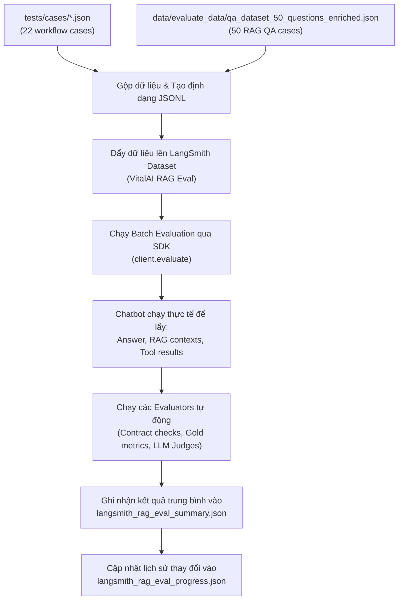

# Quy trình Đánh giá Chatbot Chi tiết (VitalAI RAG Evaluation)

Tài liệu này chi tiết hóa quy trình, bộ dữ liệu, các chỉ số đánh giá (metrics), công cụ và cách vận hành hệ thống đánh giá chatbot (RAG & Medical Tools Pipeline) của dự án **VitalAI**.

---

## 1. Tổng quan về Hệ thống Đánh giá (Evaluation Framework)
VitalAI sử dụng **LangSmith** làm nền tảng chính để quản lý bộ test cases, thực hiện batch evaluation (chạy đánh giá hàng loạt), và theo dõi chất lượng chatbot qua các phiên bản (version tracking).

Hệ thống kết hợp cả **Deterministic Rules (Kiểm tra logic cứng)** và **LLM-as-a-Judge (Dùng LLM làm giám khảo)** để đảm bảo câu trả lời của chatbot vừa chính xác về mặt kỹ thuật y khoa, vừa trôi chảy và đúng ngữ cảnh.

---

## 2. Các Bộ Dữ liệu Đánh giá (Evaluation Datasets)
Hệ thống sử dụng hai lớp dữ liệu đánh giá khác nhau phục vụ cho hai mục đích riêng biệt:

### Lớp 1: Workflow & Tool Validation Cases (`tests/cases/*.json`)
Gồm **22 test cases** dùng để kiểm tra tính ổn định của graph logic, router, các công thức tính toán y khoa và ngưỡng phân loại.
*   **General QA (`general_qa.json` - 4 cases):** Hỏi đáp y khoa tổng quát.
*   **Threshold QA (`threshold_qa.json` - 9 cases):** Phân loại chỉ số sinh học dựa trên ngưỡng (ví dụ: chỉ số ACR).
*   **Formula QA (`formula_qa.json` - 6 cases):** Tính toán công thức y khoa (ví dụ: công thức tính GFR như CKD-EPI, MDRD, Cockcroft-Gault).
*   **Formula & Threshold QA (`formula_threshold_qa.json` - 3 cases):** Vừa tính toán công thức vừa phân loại mức độ/ngưỡng dựa trên kết quả.

**Mục tiêu chính:** Đánh giá độ khớp của dữ liệu đầu ra với "Data Contract" đã định nghĩa:
*   Route có đi đúng nhánh `retrieve` hoặc gọi tool tương ứng không.
*   Tool có được gọi thành công không.
*   Các tham số của tool (payload) có chính xác không.
*   Kết quả công thức, ngưỡng phân loại có xuất hiện trong câu trả lời không.

### Lớp 2: RAG QA Dataset (`data/evaluate_data/qa_dataset_50_questions_enriched.json`)
Gồm **50 câu hỏi RAG thực tế** được trích xuất từ tài liệu y khoa gốc.
Mỗi case được làm giàu (enriched) các trường thông tin:
*   `query`: Câu hỏi của người dùng.
*   `reference_answer`: Câu trả lời chuẩn (Gold standard).
*   `required_facts`: Các ý/thông tin bắt buộc phải có trong câu trả lời hoặc ngữ cảnh được truy xuất.
*   `relevant_document_ids` & `relevant_source_ids`: Các ID tài liệu/ngưỡng/công thức chuẩn làm mốc đối chiếu cho bộ lọc RAG.
*   `source_evidence`: Các đoạn văn bản bằng chứng làm căn cứ.

---

## 3. Thiết kế các Chỉ số Đánh giá (Metric Design)

Hệ thống chấm điểm tự động thông qua tích hợp API của Judge Model (mặc định dùng `mistral-large-latest` hoặc `mistral-small-latest`) kết hợp với hàm kiểm tra logic tự động.

### 3.1. Groundedness & Hallucination (Độ tin cậy & Sự ảo tưởng)
Đo lường mức độ câu trả lời được hỗ trợ bởi ngữ cảnh (Context) thu thập từ cơ sở dữ liệu và kết quả chạy công cụ y tế (Medical Tool).
*   **Groundedness (0.0 -> 1.0):** Điểm càng cao càng tốt. Câu trả lời phải hoàn toàn dựa trên context được cung cấp.
*   **Hallucination (0.0 -> 1.0):** `1 - Groundedness` (Điểm càng thấp càng tốt). Phạt nặng nếu câu trả lời tự đưa ra chẩn đoán, thuốc kê đơn, hoặc chỉ số tính toán không xuất hiện trong context.

### 3.2. Answer Relevance (Độ liên quan của Câu trả lời)
*   **Thang điểm:** 0.0 -> 1.0.
*   LLM Judge đánh giá câu trả lời có đi đúng vào trọng tâm câu hỏi của người dùng hay không, không phạt nếu trả lời ngắn gọn hơn tài liệu gốc miễn là đủ ý và đúng tiêu đề cần hỏi.

### 3.3. Context Precision (Độ chuẩn xác của Ngữ cảnh truy xuất)
Đánh giá chất lượng của các tài liệu thu hồi được từ vector database:
1.  **LLM-based Context Precision:** Judge đánh giá xem từng chunk tài liệu lấy lên có thực sự liên quan đến câu hỏi không.
    $$\text{Score} = \frac{\text{Số chunk có liên quan}}{\text{Tổng số chunk truy xuất}}$$
2.  **Gold-ID Context Precision:** So khớp trực tiếp danh sách ID chunk lấy lên với danh sách ID chuẩn (`relevant_document_ids`).

### 3.4. Context Recall (Độ phủ của Ngữ cảnh truy xuất)
Đo lường việc hệ thống đã lấy đủ thông tin cần thiết để trả lời câu hỏi chưa:
1.  **Gold-ID Context Recall:** So khớp tỉ lệ ID tài liệu chuẩn được tìm thấy trong tập hợp tài liệu thu hồi.
2.  **Required Facts Exact Recall:** Đo lường tỷ lệ các sự thật bắt buộc (`required_facts`) xuất hiện chính xác trong context.
3.  **LLM-based Context Recall:** LLM Judge đọc context và đánh giá xem thông tin thu hồi được có đủ để sinh ra câu trả lời chuẩn (`reference_answer`) không.

---

## 4. Quy trình Thực hiện Đánh giá (Evaluation Workflow)

Quy trình đánh giá được thực hiện qua các bước tự động hóa bằng script trong thư mục `scripts/`:



### Các lệnh chạy chính:
1.  **Chuẩn bị và làm giàu dữ liệu đánh giá:**
    ```bash
    .venv/bin/python scripts/prepare_langsmith_eval_data.py
    ```
2.  **Đẩy Dataset lên LangSmith (đồng bộ hóa dữ liệu cục bộ lên web):**
    ```bash
    .venv/bin/python scripts/langsmith_rag_evaluate.py \
      --dataset "VitalAI RAG QA Eval" \
      --dataset-source qa \
      --upload-policy update-existing \
      --upload-only
    ```
3.  **Chạy Đánh giá tự động đầy đủ (sử dụng LLM Judges):**
    ```bash
    .venv/bin/python scripts/langsmith_rag_evaluate.py \
      --dataset "VitalAI RAG Eval Dev" \
      --dataset-source all \
      --category all \
      --experiment-prefix "vitalai-rag" \
      --max-concurrency 1 \
      --use-llm-judges
    ```
    *(Có thể sử dụng shell script tiện ích để chạy nhanh: `bash scripts/run_langsmith_rag_eval.sh eval`)*

---

## 5. Mục tiêu và Tiêu chuẩn Chất lượng (Quality Targets)

Các ngưỡng chỉ số (CI Gate / Target Metrics) được định nghĩa trong file tracking `tests/results/langsmith_rag_eval_progress.json`:

| Chỉ số đánh giá | Ngưỡng yêu cầu (Target) |
| :--- | :--- |
| **Answer Relevance** | $\ge 0.85$ |
| **Groundedness (Độ tin cậy)** | $\ge 0.85$ |
| **Hallucination (Ảo tưởng)** | $\le 0.15$ |
| **Context Precision (LLM)** | $\ge 0.55$ |
| **Context Recall (LLM)** | $\ge 0.70$ |

---

## 6. Bài học kinh nghiệm & Tối ưu hóa trong quá trình đánh giá

*   **Tránh bộ lọc cứng quá mức (Hard filters):** Trong phiên bản Evaluation v2, việc sử dụng bộ lọc cứng theo tên bệnh từ Query làm giảm mạnh `context_recall_llm` và `groundedness` do các bài viết y khoa thường nằm dưới các danh mục rộng hơn (như *Bệnh lý cầu thận* thay vì tên bệnh cụ thể). Từ phiên bản v2.1, tên bệnh trích xuất từ Query chỉ đóng vai trò là **Soft Hint** (gợi ý mềm để tăng điểm rerank), bộ lọc cứng chỉ áp dụng khi có kết quả chính xác từ Medical Tool.
*   **Tách biệt tìm kiếm:** Sử dụng query gốc cho tìm kiếm từ khóa (Full-Text Search) để bắt chính xác các cụm từ chuyên môn, trong khi sử dụng query mở rộng (Enriched Query) cho tìm kiếm ngữ nghĩa (Embedding/Vector Search).
*   **Tránh lỗi Rate Limit (HTTP 429):** Khi chạy song song nhiều trường hợp chấm điểm với Mistral API, dễ gặp lỗi quá tải. Script hỗ trợ cấu hình `--max-concurrency 1` và tăng `--judge-delay-seconds` cùng cơ chế lũy tiến thời gian chờ (exponential backoff) để đảm bảo quá trình đánh giá không bị gián đoạn.
