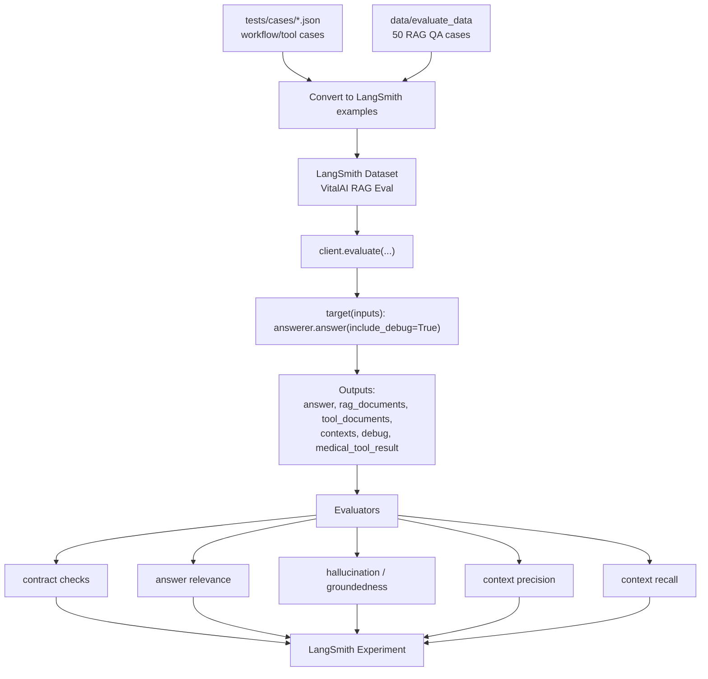

# RAG Evaluation With LangSmith

Tài liệu này đề xuất cách evaluate hàng loạt RAG pipeline hiện tại của VitalAI bằng LangSmith.

## Hiện Trạng Eval Data

Repo hiện có 2 lớp eval data, dùng cho 2 mục tiêu khác nhau:

1. `tests/cases/*.json`: 22 workflow/tool cases để bắt regression của graph, router, medical tool, công thức và ngưỡng.
2. `data/evaluate_data/qa_dataset_50_questions_enriched.json`: 50 RAG QA cases lấy từ tài liệu gốc, có ground truth, required facts và source evidence.

Bộ `tests/cases/*.json` gồm:

- `general_qa.json`: 4 case hỏi đáp y khoa chung.
- `threshold_qa.json`: 9 case có ngưỡng/phân loại chỉ số.
- `formula_qa.json`: 6 case có công thức.
- `formula_threshold_qa.json`: 3 case vừa tính công thức vừa phân loại/ngưỡng.

Tổng: 22 workflow cases.

Các case workflow có `expected` dạng contract check:

- route có phải `retrieve` không
- tool có được gọi không
- tool có success không
- formula/threshold/classification có xuất hiện không
- answer có chứa hoặc không chứa keyword nhất định không
- tool parameters có `null` không

Điểm mạnh:

- Bắt regression của graph/tool/router.
- Bắt lỗi shape, route, tool payload, formula id, threshold match.
- Rẻ, deterministic, chạy nhanh.

Các case workflow hiện đã được enrich thêm:

- `reference_answer`: câu trả lời chuẩn ngắn gọn.
- `required_facts`: các fact bắt buộc answer/context phải bao phủ.
- `relevant_document_ids`: gold IDs dạng `chunk::*`, `threshold::*`, `formula::*`.
- `relevant_source_ids`: source IDs không có prefix để match cả RAG docs và tool docs.
- `eval_tags` và `eval_notes`: phục vụ filter/nhóm experiment trên LangSmith.

Bộ 50 QA cases được sinh từ `data/evaluate_data/qa_dataset_50_questions.json`, rồi map lại vào `data/processed_data` để lấy source evidence. File import trực tiếp cho LangSmith website:

- `data/evaluate_data/langsmith_rag_dataset.json`
- `data/evaluate_data/langsmith_rag_dataset.jsonl`

Regenerate data sau khi sửa nguồn:

```bash
.venv/bin/python scripts/prepare_langsmith_eval_data.py
```

## Metric Design

### 1. Hallucination / Groundedness

Input cho evaluator:

- `question`
- `answer`
- `rag_contexts`: retrieved chunks từ `debug.results`
- `tool_contexts`: evidence structured từ `medical_tool_result`
- `contexts`: hợp nhất `rag_contexts + tool_contexts`

Định nghĩa nên dùng:

- `groundedness`: cao là tốt, answer được hỗ trợ bởi context/tool result.
- `hallucination`: thấp là tốt, `1 - groundedness`.

Judge rule:

- Không phạt nếu answer nói ngắn hơn context.
- Phạt nếu answer thêm chẩn đoán/thuốc/xét nghiệm/nguyên nhân không có trong context/tool.
- Với tool cases, số liệu/công thức/ngưỡng phải khớp `medical_tool_result`.

Lưu ý khi dùng evaluator trên LangSmith website:

- Không dùng evaluator `Hallucination` mặc định nếu chưa map đúng field, vì output của web runner có thể nằm ở `outputs.output.content`, còn output của script nằm ở `outputs.answer`.
- Nếu evaluator thấy `outputs: {}` hoặc không có answer, không được chấm hallucination = 1. Hãy trả metric dạng `hallucination_eval_skipped` để tách lỗi schema khỏi lỗi nội dung.
- Nếu chạy raw model trên website thay vì RAG target trong script, thường sẽ không có `outputs.contexts`; khi đó chỉ có thể chấm theo `reference_outputs.reference_context`, không phải true RAG-groundedness.
- Nếu gặp `HTTPStatusError 429` từ Mistral, đó là lỗi rate limit/capacity của judge model, không phải hallucination thật. Giảm concurrency, đổi judge model, hoặc chạy lại experiment mới.

Prompt evaluator gợi ý cho LangSmith UI:

```text
You are a strict evaluator for a Vietnamese medical RAG system.

You receive JSON with:
- inputs: user question.
- outputs: model output. The answer can be in outputs.answer, outputs.output.content, outputs.output, outputs.content, or outputs.text.
- reference_outputs: gold answer/context. The grounding context can be in outputs.contexts, outputs.context, outputs.documents[*].content, outputs.rag_contexts, outputs.tool_contexts, reference_outputs.reference_context, or reference_outputs.source_evidence[*].content_preview.

Task:
1. Extract QUESTION from inputs.query.
2. Extract ANSWER using this priority:
   outputs.answer -> outputs.output.content -> outputs.output -> outputs.content -> outputs.text.
3. Extract CONTEXT using this priority:
   outputs.contexts -> outputs.context -> outputs.documents[*].content -> outputs.rag_contexts + outputs.tool_contexts -> reference_outputs.reference_context -> reference_outputs.source_evidence[*].content_preview.
4. If ANSWER is empty, return:
   {"key":"hallucination_eval_skipped","score":0,"comment":"Missing answer output; expected outputs.answer or outputs.output.content."}
5. If CONTEXT is empty, return:
   {"key":"hallucination_eval_skipped","score":0,"comment":"Missing grounding context; cannot grade hallucination."}
6. Otherwise score hallucination from 0 to 1:
   0 means fully supported by CONTEXT.
   1 means mostly unsupported or contradicted by CONTEXT.
7. Penalize unsupported diagnoses, medications, lab thresholds, formula results, percentages, or causal claims.
8. Do not penalize the answer for being shorter than the context.

Return only JSON:
{"key":"hallucination","score":<number 0..1>,"comment":"short Vietnamese explanation"}
```

### 2. Answer Relevance

Input:

- `question`
- `answer`

Định nghĩa:

- Answer phải trả lời đúng trọng tâm câu hỏi.
- Không cần reference answer.
- Không đánh giá factual correctness sâu; factual correctness thuộc groundedness/correctness.

### 3. Context Precision

Có 2 mức:

1. LLM-based precision:
   - Judge từng retrieved chunk có liên quan đến question không.
   - Score = số chunk relevant / tổng chunk retrieved.

2. Gold-id precision:
   - Khi dataset có `relevant_document_ids`.
   - Score = retrieved relevant ids / retrieved ids.

Khuyến nghị:

- Dùng `rag_context_precision_gold_ids` để đo riêng retriever.
- Dùng `context_precision_gold_ids` để đo toàn pipeline sau khi đã thêm tool evidence.

### 4. Context Recall

Context recall chuẩn cần biết hệ thống phải retrieve những gì.

Nên bổ sung vào mỗi case một trong các field:

```json
{
  "reference_answer": "ACR 350 mg/g thuộc nhóm A3, biểu hiện albumin niệu tăng nặng...",
  "required_facts": [
    "ACR >= 300 mg/g thuộc nhóm A3",
    "A3 là albumin niệu tăng nặng"
  ],
  "relevant_document_ids": [
    "threshold::ACR::A3"
  ]
}
```

Score đề xuất:

- `rag_context_recall_gold_ids`: retriever có lấy đúng source không.
- `context_recall_gold_ids`: toàn pipeline có source đúng không, tính cả medical tool evidence.
- `rag_context_recall_required_facts_exact`: fact exact-match trong RAG context.
- `context_recall_required_facts_exact`: fact exact-match trong RAG + tool context.

LLM judge vẫn nên dùng cho recall/groundedness vì exact-match tiếng Việt dễ bị thấp nếu khác diễn đạt.

## LangSmith Workflow



## Change Tracking For Accuracy Work

Baseline/progress file:

- `tests/results/langsmith_rag_eval_progress.json`

Current intended workflow:

1. Record baseline metrics in `baseline.metrics`.
2. Make one retrieval/graph change.
3. Add a short `LANGSMITH_CHANGE_NOTE`.
4. Run eval.
5. Compare `latest.metrics` against `baseline.metrics` and previous `runs`.

Recommended command after retrieval planner changes:

```bash
LANGSMITH_CHANGE_NOTE="retrieval planner v2: tool-aware hard filters + soft hints" \
LANGSMITH_JUDGE_DELAY_SECONDS=3 \
bash scripts/run_langsmith_rag_eval.sh eval
```

Expected metric movement:

- `context_precision_llm`: should improve because retrieval query is more focused.
- `context_recall_llm`: should improve or stay stable because uncertain section/biomarker are soft hints, not hard filters.
- `groundedness`: should improve if better context reaches final prompt.
- `hallucination`: should decrease as a consequence of better grounding.

Important caveat:

- `context_precision_gold_ids` and `context_recall_gold_ids` can remain low if gold source IDs in the dataset are imperfect. Use LLM context metrics plus manual source audit before concluding retrieval got worse.

Regression note from first planner eval:

- Experiment `rag-eval-small-judge-fad4bb6b` scored worse than baseline: `context_precision_llm=0.296`, `groundedness=0.652`, `hallucination=0.348`.
- Likely cause: planner v2 hard-filtered disease from query aliases. The corpus has many correct chunks under broad metadata such as `benh_ly_cau_than`, so this reduced useful evidence.
- Additional cause: enriched multi-line retrieval queries were also sent directly to full-text search, making keyword search too noisy.
- Fix v2.1: disease aliases from query are now soft hints only. Hard disease filters are reserved for explicit request filters or medical tool result. Full-text search now uses the original first query line while embedding still uses the enriched query.

Next improvement v3:

- Retrieval results now expose fuller `content` and parent/neighbor chunk context.
- Final prompt uses expanded `content`, not only short preview.
- Final answer prompt was tightened to answer only directly supported facts and state missing data instead of filling gaps.
- Expected impact: improve `groundedness`, reduce `hallucination`, and improve required-fact recall.

## Recommended Dataset Schema

LangSmith example `inputs`:

```json
{
  "query": "ACR 350 mg/g có ý nghĩa gì?",
  "top_k": 5,
  "disease_name": null,
  "section_type": null,
  "source_type": null,
  "biomarker": null
}
```

LangSmith example `outputs`:

```json
{
  "expected": {
    "require_route": "retrieve",
    "require_tool_called": true,
    "require_tool_success": true
  },
  "reference_answer": "ACR 350 mg/g thuộc nhóm A3...",
  "reference_context": "if ACR >= 300 then A3",
  "required_facts": [
    "ACR >= 300 mg/g thuộc nhóm A3"
  ],
  "relevant_document_ids": [
    "..."
  ],
  "relevant_source_ids": [
    "..."
  ],
  "source_evidence": []
}
```

LangSmith example `metadata`:

```json
{
  "case_id": "threshold_001",
  "category": "threshold_qa",
  "title": "ACR muc cao",
  "tags": ["threshold", "acr", "medical_tool"]
}
```

Target output nên trả:

```json
{
  "answer": "...",
  "output": "...",
  "content": "...",
  "context": "retrieved chunk 1\n\nretrieved chunk 2",
  "route": "retrieve",
  "contexts": ["retrieved chunk 1", "retrieved chunk 2"],
  "rag_contexts": ["retrieved chunk 1"],
  "tool_contexts": ["tool evidence 1"],
  "documents": [
    {
      "document_id": "...",
      "source_id": "...",
      "source_type": "chunk",
      "content": "..."
    }
  ],
  "rag_documents": [],
  "tool_documents": [],
  "medical_tool_result": {},
  "router_plan": {},
  "extracted_tool_payload": {}
}
```

## Automation Options

### Option A: Programmatic evaluators in Python

Dùng `Client.evaluate(...)` hoặc `evaluate(...)` từ LangSmith SDK.

Ưu điểm:

- Version control evaluator prompt/code trong repo.
- CI/CD chạy được.
- Dễ so sánh experiment prefix theo git SHA/model/prompt version.

Nhược điểm:

- Cần quản lý judge model và chi phí.

### Option B: Bind evaluators to dataset trong LangSmith UI

Ưu điểm:

- Khi tạo experiment mới trên dataset, evaluators tự chạy.
- Dễ chỉnh evaluator trong UI.

Nhược điểm:

- Logic evaluator không nằm hết trong repo.
- Khó review thay đổi bằng git.

Khuyến nghị cho VitalAI:

- Giai đoạn đầu dùng Option A để version hóa evaluator.
- Sau khi metric ổn định, bind evaluator chuẩn vào dataset trên LangSmith UI để mọi experiment mới tự được chấm.

## Batch Evaluation Command

### Chuẩn bị dataset

Tạo lại toàn bộ enriched dataset:

```bash
.venv/bin/python scripts/prepare_langsmith_eval_data.py
```

Export JSONL để upload thủ công trên LangSmith website:

```bash
.venv/bin/python scripts/langsmith_rag_evaluate.py \
  --dataset-source qa \
  --skip-upload \
  --upload-only \
  --export-jsonl tests/results/langsmith_qa_examples.jsonl

.venv/bin/python scripts/langsmith_rag_evaluate.py \
  --dataset-source cases \
  --category all \
  --skip-upload \
  --upload-only \
  --export-jsonl tests/results/langsmith_case_examples.jsonl

.venv/bin/python scripts/langsmith_rag_evaluate.py \
  --dataset-source all \
  --category all \
  --skip-upload \
  --upload-only \
  --export-jsonl tests/results/langsmith_all_examples.jsonl
```

Upload dataset bằng script:

```bash
.venv/bin/python scripts/langsmith_rag_evaluate.py \
  --dataset "VitalAI RAG QA Eval" \
  --dataset-source qa \
  --upload-policy update-existing \
  --upload-only

.venv/bin/python scripts/langsmith_rag_evaluate.py \
  --dataset "VitalAI Workflow Tool Eval" \
  --dataset-source cases \
  --category all \
  --upload-policy update-existing \
  --upload-only
```

`--upload-policy update-existing` giúp rerun an toàn trên cùng dataset: example mới được tạo, example cũ được update thay vì lỗi `409 Conflict`. Nếu muốn giữ nguyên dataset đã upload, dùng `--upload-policy skip-existing`; nếu muốn LangSmith báo lỗi khi trùng ID, dùng `--upload-policy fail`.

Chạy nhanh bằng shell script:

```bash
bash scripts/run_langsmith_rag_eval.sh all

LANGSMITH_UPLOAD_POLICY=skip-existing bash scripts/run_langsmith_rag_eval.sh upload
```

### Chạy programmatic experiment

```bash
.venv/bin/python scripts/langsmith_rag_evaluate.py \
  --dataset "VitalAI RAG Eval Dev" \
  --dataset-source all \
  --category all \
  --experiment-prefix "vitalai-rag" \
  --max-concurrency 1 \
  --target-delay-seconds 1 \
  --judge-delay-seconds 5 \
  --judge-max-attempts 4 \
  --judge-backoff-seconds 30 \
  --summary-json tests/results/langsmith_rag_eval_summary.json \
  --use-llm-judges
```

Sau khi chạy xong, script sẽ gom tất cả metric từ `ExperimentResults`, tính trung bình từng key và ghi ra JSON gọn:

```json
{
  "answer_relevance": 0.84,
  "context_precision_gold_ids": 0.31,
  "context_recall_gold_ids": 0.62,
  "context_recall_llm": 0.78,
  "groundedness": 0.86,
  "hallucination": 0.14
}
```

File mặc định:

```bash
tests/results/langsmith_rag_eval_summary.json
```

Nếu vẫn gặp `HTTPStatusError 429` hoặc `service_tier_capacity_exceeded`, tăng delay/backoff và giữ concurrency bằng 1:

```bash
LANGSMITH_MAX_CONCURRENCY=1 \
LANGSMITH_TARGET_DELAY_SECONDS=2 \
LANGSMITH_JUDGE_DELAY_SECONDS=10 \
LANGSMITH_JUDGE_MAX_ATTEMPTS=6 \
LANGSMITH_JUDGE_BACKOFF_SECONDS=60 \
bash scripts/run_langsmith_rag_eval.sh eval
```

Nếu vẫn bị 429 dù đã chờ lâu, đó là quota/capacity phía Mistral. Khi đó có 3 hướng an toàn: chạy lại sau vài phút, đổi sang judge model/quota ổn hơn, hoặc tạm tắt `--use-llm-judges` để chỉ lấy deterministic metrics như `gold_context_metrics`.

Yêu cầu env:

```bash
LANGSMITH_TRACING=true
LANGSMITH_API_KEY=...
LANGSMITH_PROJECT=vitalai-rag-eval
MISTRAL_CLIENT_API_KEY=...
LANGSMITH_EVAL_MODEL=mistral-small-latest
MODEL_NAME=mistral-large-latest
MEDICAL_TOOLS_BASE_URL=http://localhost:8010
DATABASE_URL=...
OPENAI_API_KEY=...
```

Chạy services trước:

```bash
./scripts/run_medical_tools_service.sh
./scripts/run_ai_service.sh
```

Nếu chỉ chạy qua `answerer` trong script thì không bắt buộc chạy AI FastAPI, nhưng vẫn cần medical tools service nếu graph gọi HTTP tool.

## Rollout Plan

### Phase 1: Dataset upload trên LangSmith website

- Dùng `data/evaluate_data/langsmith_rag_dataset.jsonl` hoặc `tests/results/langsmith_qa_examples.jsonl` để import 50 QA cases.
- Dùng `tests/results/langsmith_case_examples.jsonl` để import workflow/tool cases nếu muốn kiểm thử graph/tool.
- Dataset QA dùng cho hallucination, answer relevance, context precision/recall.
- Dataset workflow dùng cho route/tool/formula/threshold correctness.

### Phase 2: Programmatic evaluators trong repo

- `answer_relevance`
- `groundedness`
- `hallucination`
- `context_precision_llm`
- `context_recall_llm`
- `contract_checks`
- `gold_context_metrics`

### Phase 3: Theo dõi riêng retriever và full pipeline

- Retriever-only:
  - `rag_context_precision_gold_ids`
  - `rag_context_recall_gold_ids`
  - `rag_context_recall_required_facts_exact`

- Full pipeline:
  - `context_precision_gold_ids`
  - `context_recall_gold_ids`
  - `context_recall_required_facts_exact`
  - `groundedness`
  - `hallucination`

### Phase 4: CI Gate

Đặt ngưỡng ví dụ:

- `contract_pass_rate >= 0.95`
- `answer_relevance >= 0.85`
- `groundedness >= 0.85`
- `hallucination <= 0.10`
- `context_precision >= 0.70`
- `context_recall >= 0.75` sau khi có gold facts

CI không nên fail vì 1 case LLM judge đơn lẻ; nên gate theo trung bình và theo nhóm critical.
